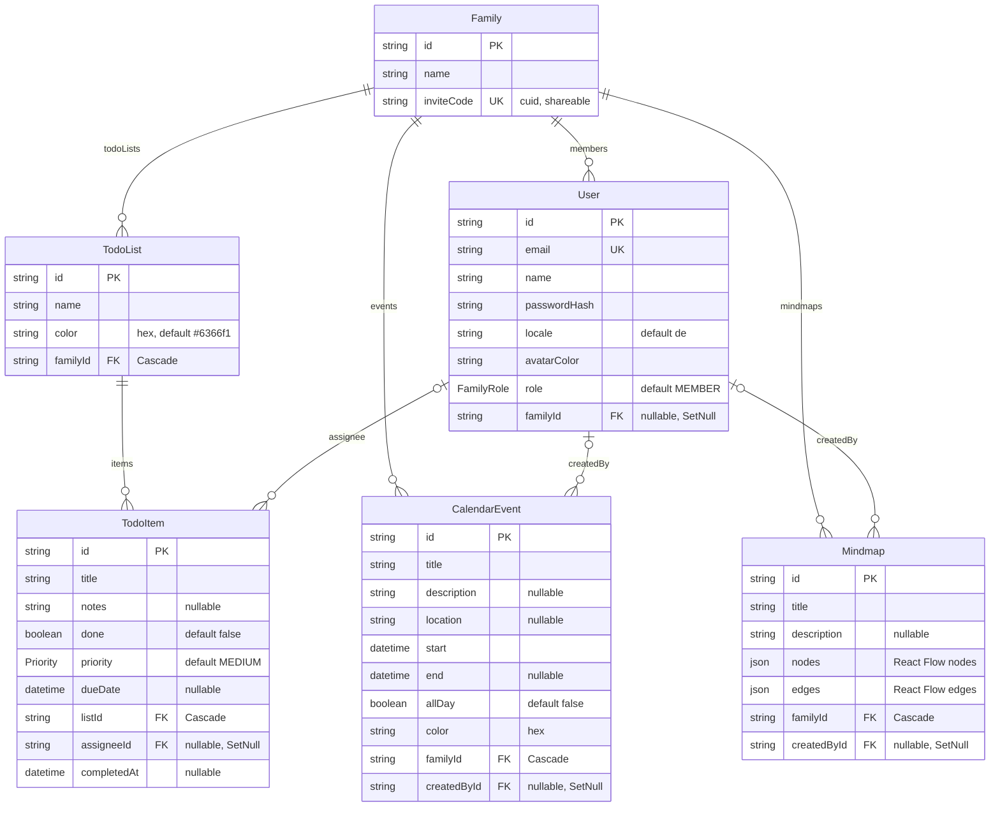

# Database

FamilyHub uses **PostgreSQL** with **Prisma 7**. The schema lives in `prisma/schema.prisma`; CLI configuration lives in `prisma.config.ts`.

## Data model

The `Family` is the root of (almost) everything: users belong to a family, and all feature data hangs off the family. Deleting a family cascades to its lists, events, and mindmaps; deleting a user never destroys family data (references are set to `NULL`).



### Models in brief

- **User** — account with `email` (unique), `name`, bcrypt `passwordHash`, preferred `locale` (`de` default), `avatarColor`, and `role`. `familyId` is **nullable**: a freshly registered user has no family until onboarding. `onDelete: SetNull` on the family relation means deleting a family detaches users instead of deleting them.
- **Family** — has a `name` and a unique `inviteCode` (a cuid, generated automatically) that members share so others can join. Owns all feature data.
- **TodoList / TodoItem** — lists carry a `name` and hex `color`; items carry `title`, optional `notes`, `done` + `completedAt`, `priority`, optional `dueDate` (stored anchored at 12:00 to keep the calendar day stable across timezones), and an optional `assignee` (must be a family member — enforced in the server action).
- **CalendarEvent** — `start` is always set; `end` is optional; `allDay` switches between date-only and timed semantics. `createdBy` is informational.
- **Mindmap** — persists React Flow state directly as two `Json` columns, `nodes` and `edges` (default `"[]"`). Node `data` includes the label and the node kind (`topic`, `idea`, `pro`, `con`, `question`). The whole graph is saved on auto-save, not per node.

### Enums

| Enum | Values | Used by |
| --- | --- | --- |
| `FamilyRole` | `ADMIN`, `MEMBER` | `User.role` — currently informational only (shown in settings, not enforced) |
| `Priority` | `LOW`, `MEDIUM`, `HIGH` | `TodoItem.priority` (default `MEDIUM`) |

### Delete behavior cheat-sheet

| Relation | onDelete | Effect |
| --- | --- | --- |
| Family → User | `SetNull` | family deleted → users keep their accounts, lose the family |
| Family → TodoList / CalendarEvent / Mindmap | `Cascade` | family deleted → all its data is removed |
| TodoList → TodoItem | `Cascade` | list deleted → its items go too |
| User → TodoItem.assignee, CalendarEvent.createdBy, Mindmap.createdBy | `SetNull` | user deleted → references blank out, data survives |

## Prisma 7 specifics: `prisma.config.ts`

Prisma 7 moved CLI configuration out of `schema.prisma` into a TypeScript config file:

```ts
// prisma.config.ts
import 'dotenv/config';
import { defineConfig } from 'prisma/config';

export default defineConfig({
  schema: 'prisma/schema.prisma',
  migrations: { path: 'prisma/migrations' },
  datasource: { url: process.env.DATABASE_URL! },
});
```

Things to know:

- The **datasource URL is no longer in the schema** — `datasource db` only declares `provider = "postgresql"`. The CLI gets the URL from `prisma.config.ts`.
- The config file imports `dotenv/config` explicitly; the Prisma CLI does not load `.env` for you here. If `DATABASE_URL` is unset, CLI commands fail at config load time.
- At **runtime** the app does not use the config file at all: `src/lib/prisma.ts` constructs the client with the **`@prisma/adapter-pg` driver adapter** (a regular `pg` connection pool) using `DATABASE_URL` from the environment. There is no query engine binary.

## Migration workflow

### During development

```bash
# after editing prisma/schema.prisma:
npx prisma migrate dev --name describe_your_change
```

This diffs the schema, writes a new SQL migration to `prisma/migrations/`, applies it to your local database, and regenerates the Prisma client. Commit the generated migration folder together with the schema change.

Useful extras:

```bash
npx prisma migrate reset   # drop + re-apply all migrations + run the seed
npx prisma studio          # browse data in the browser
```

### In production

```bash
npx prisma migrate deploy
```

Applies pending migrations without generating anything new. You normally never run this by hand:

- **Docker**: the container entrypoint runs `prisma migrate deploy` on every start.
- **Vercel**: run it as part of the build step (see [deployment.md](deployment.md)).

Never run `migrate dev` against a production database — it may reset data when it detects drift.

## Seeding

```bash
npm run db:seed
```

Creates a demo family with two members for local development and demos:

| Email | Password | Role |
| --- | --- | --- |
| `anna@example.com` | `password123` | ADMIN |
| `max@example.com` | `password123` | MEMBER |

The seed also creates sample todo lists, calendar events, and a mindmap so every feature has data to show. Seeding is idempotent-ish for demos but intended for **development databases only**.
