# Use-Cases

Diese Seite zeigt **alle aktuellen Use-Cases** von FamilyHub – mit Screenshots aus der laufenden App. Jede Familie teilt sich Aufgaben, Termine und Mindmaps an einem Ort. Es gibt keine privaten Listen: was du siehst, sieht die ganze Familie.

Die Screenshots stammen von der Demo-Familie „Familie Muster“. Auf dem Handy navigierst du über die Leiste am unteren Rand, am Desktop über die Seitenleiste.

---

## 1. Konto anlegen und anmelden

### Anmelden

Öffne FamilyHub, gib **E-Mail** und **Passwort** ein und tippe auf **Anmelden**. Du bleibst angemeldet, bis du dich abmeldest.

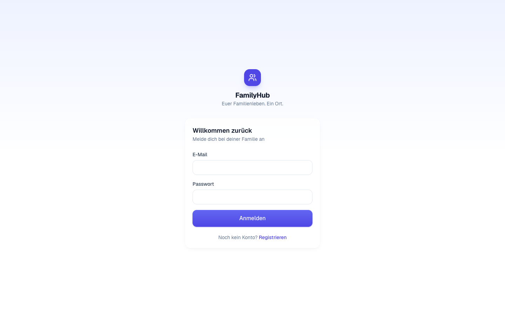

### Falsche Zugangsdaten

Stimmt E-Mail oder Passwort nicht, erscheint eine Fehlermeldung. Eine „Passwort vergessen“-Funktion gibt es noch nicht.

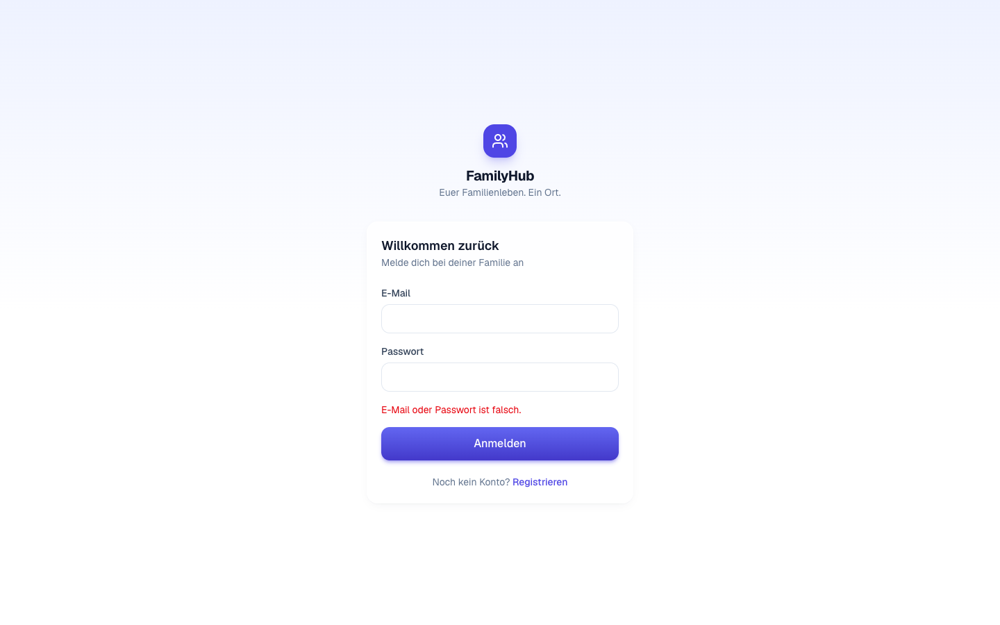

### Registrieren

Noch kein Konto? Über **Registrieren** legst du eines an: **Dein Name**, **E-Mail** und ein **Passwort** (mindestens 8 Zeichen). Jedes Familienmitglied braucht eine eigene E-Mail-Adresse.

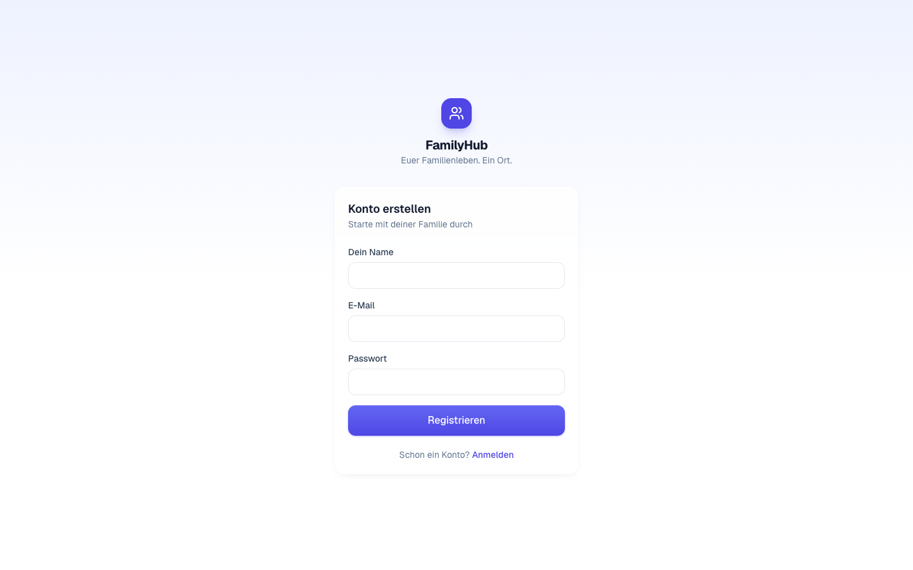

### Familie gründen oder beitreten

Direkt nach der Registrierung: **Neue Familie gründen** (du bist die erste Person) oder **Familie beitreten** mit dem Einladungscode.

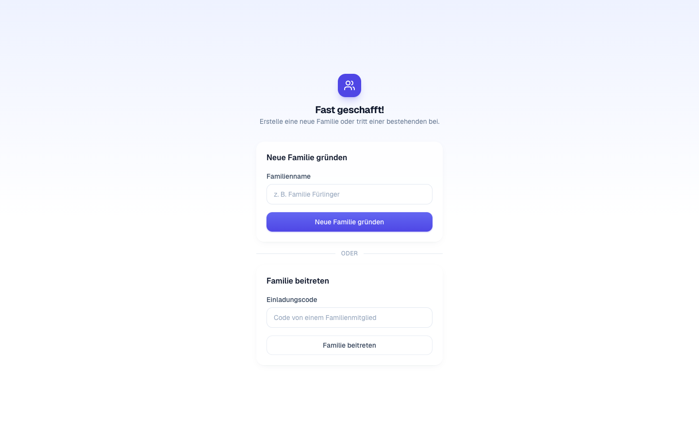

| Use-Case | Wo | Ergebnis |
| --- | --- | --- |
| Konto erstellen | Registrieren | Eigenes Konto, noch ohne Familie |
| Familie gründen | Onboarding | Du wirst Admin, bekommst einen Einladungscode |
| Familie beitreten | Onboarding | Du siehst dieselben Listen, Termine und Mindmaps |
| Anmelden | Login | Zurück zur Übersicht |
| Abmelden | Seitenleiste (Desktop) | Sitzung beendet |

---

## 2. Überblick behalten

Die **Übersicht** ist der Start nach dem Login: offene Aufgaben, Termine heute, Mindmaps, plus die nächsten Aufgaben und Termine.

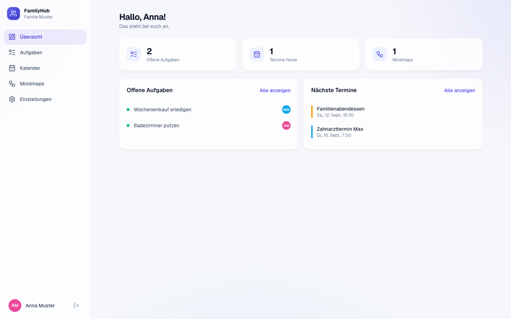

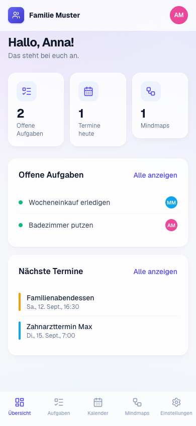

| Use-Case | Was du siehst |
| --- | --- |
| Tagesstart | Begrüßung, Kennzahlen, was heute ansteht |
| Heute fällig / überfällig | Aufgaben mit Fälligkeitsdatum auf der Übersicht |
| Termine heute / nächste Tage | Karten mit Farbe, Uhrzeit und Ort |
| Schnellsprung | Karten und „Alle anzeigen“ führen zu Aufgaben, Kalender oder Mindmaps |

---

## 3. Aufgaben organisieren

### Listen

Aufgaben leben in Listen, z. B. „Haushalt“ oder „Einkaufen“. Jede Liste hat einen Namen und eine Farbe.

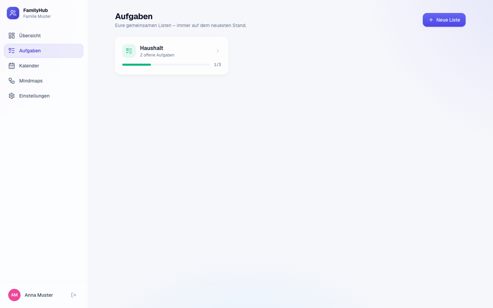

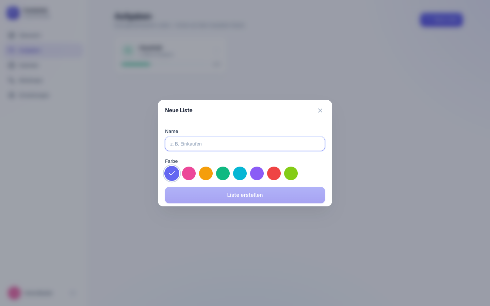

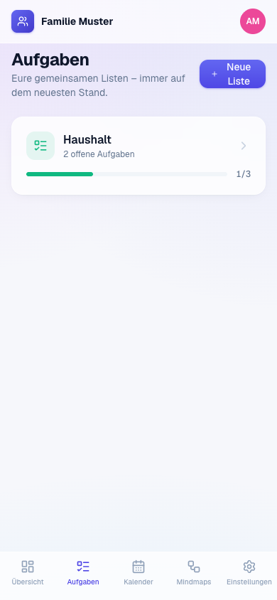

### Aufgaben in einer Liste

In der Liste siehst du offene und erledigte Aufgaben, kannst per Schnellfeld eine neue anlegen und vorhandene abhaken oder bearbeiten.

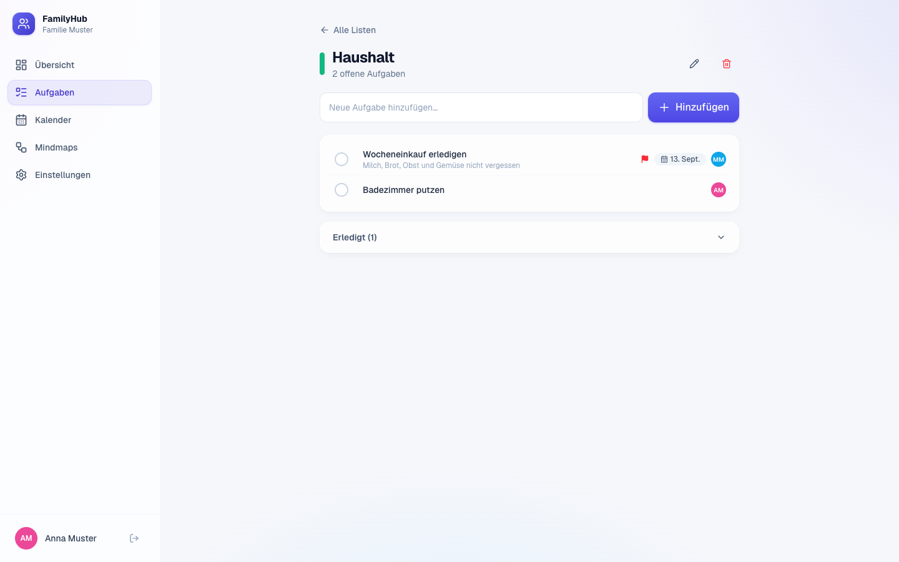

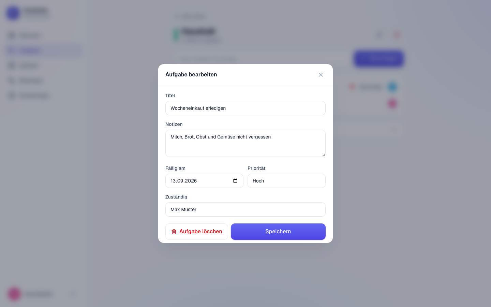

| Use-Case | Schritte |
| --- | --- |
| Liste anlegen | Aufgaben → **Neue Liste** → Name + Farbe → **Liste erstellen** |
| Liste umbenennen / Farbe ändern | Liste öffnen → **Liste bearbeiten** |
| Liste löschen | Liste öffnen → **Liste löschen** (löscht auch alle Aufgaben darin) |
| Aufgabe anlegen | Liste öffnen → Schnellfeld oder **Hinzufügen** |
| Fälligkeit setzen | Aufgabe öffnen → **Fällig am** |
| Priorität setzen | Niedrig, Mittel oder Hoch |
| Zuweisen | **Zuständig** auf ein Familienmitglied oder „Niemand“ |
| Notizen | z. B. Einkaufsliste, Links, Hinweise |
| Erledigen | Kästchen antippen; nochmal antippen macht es rückgängig |
| Aufgabe löschen | Aufgabe öffnen → **Aufgabe löschen** |

---

## 4. Familientermine planen

Der **Kalender** zeigt den Monat, farbige Einträge pro Tag und darunter die Tagesübersicht.

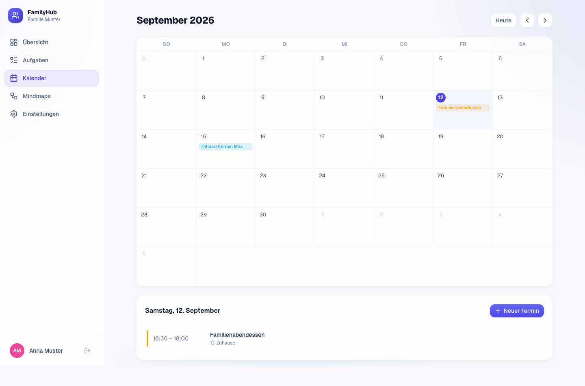

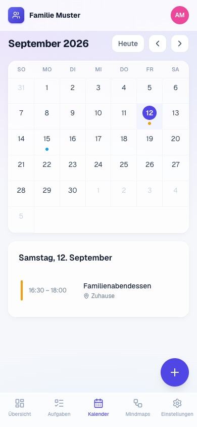

### Termin anlegen oder ändern

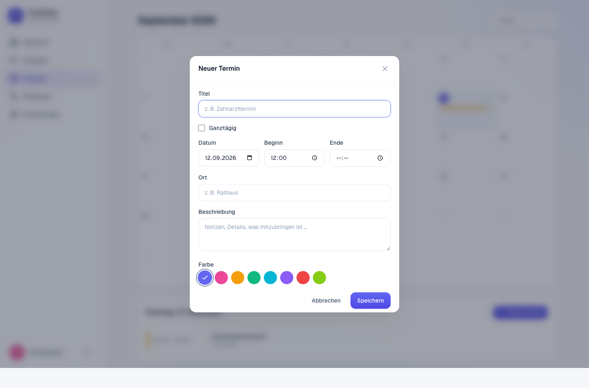

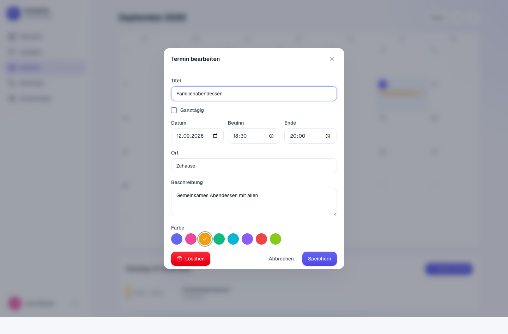

| Use-Case | Schritte |
| --- | --- |
| Monat wechseln | Pfeile oder **Heute** |
| Tag ansehen | Tag im Raster antippen |
| Termin mit Uhrzeit | **Neuer Termin** → Titel, Datum, Beginn/Ende, optional Ort, Beschreibung, Farbe |
| Ganztägiger Termin | Häkchen **Ganztägig** (Geburtstag, Ferien, Feiertag) |
| Termin bearbeiten | Eintrag in der Tagesliste antippen |
| Termin löschen | Im Dialog **Löschen** (mit Nachfrage) |

Wiederkehrende Termine („jeden Dienstag Training“) gibt es noch nicht – solche Termine legst du einzeln an.

---

## 5. Entscheidungen in Mindmaps

Mindmaps helfen, Optionen, Pro, Contra und offene Fragen sichtbar zu machen – z. B. Urlaub, Haustier, Anschaffung.

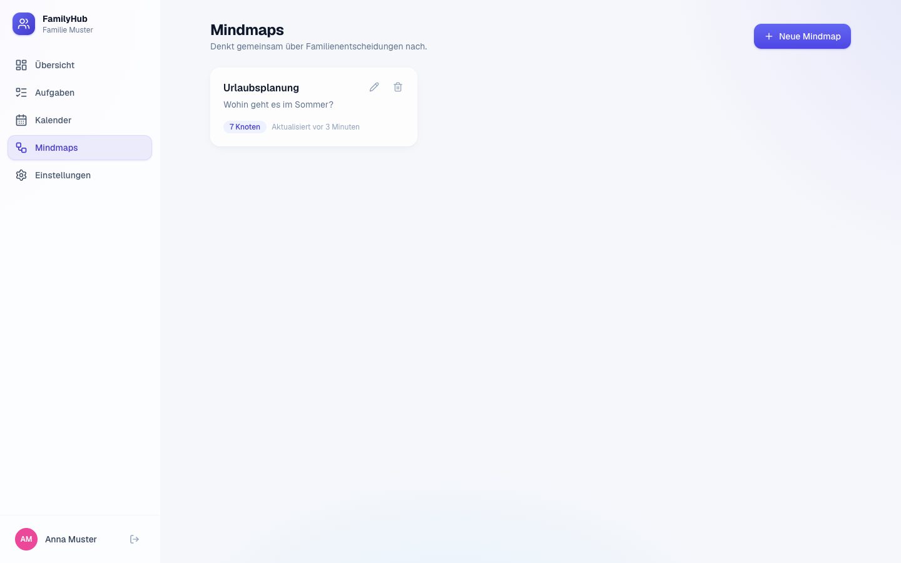

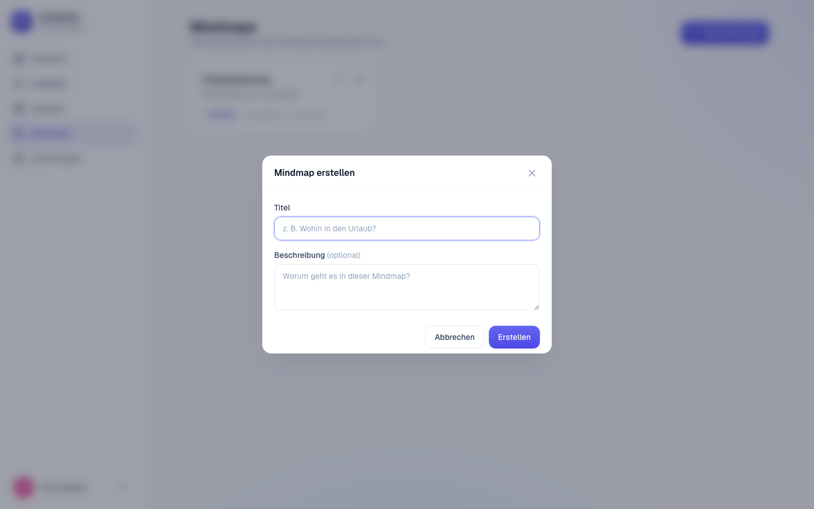

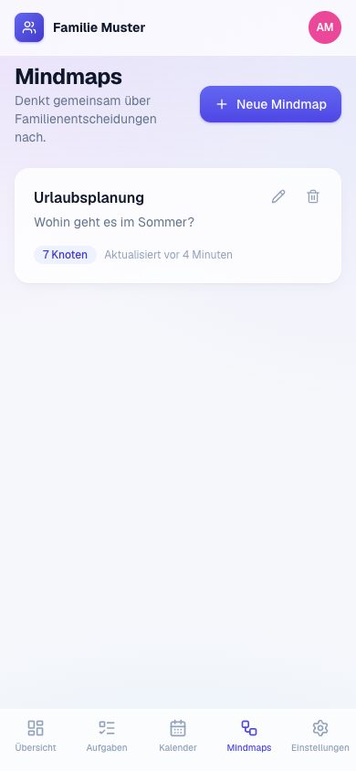

### Im Editor arbeiten

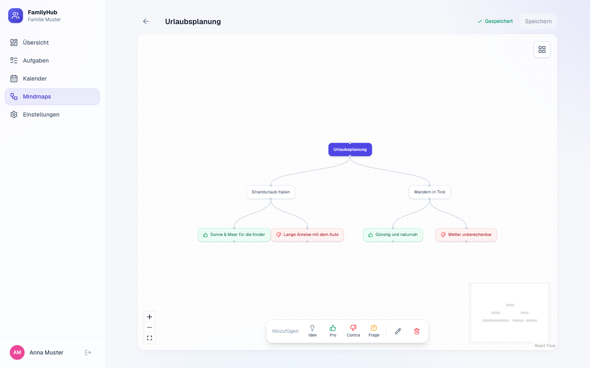

Knoten antippen: unten erscheint die Leiste zum **Hinzufügen** (Idee, Pro, Contra, Frage), Bearbeiten und Löschen.

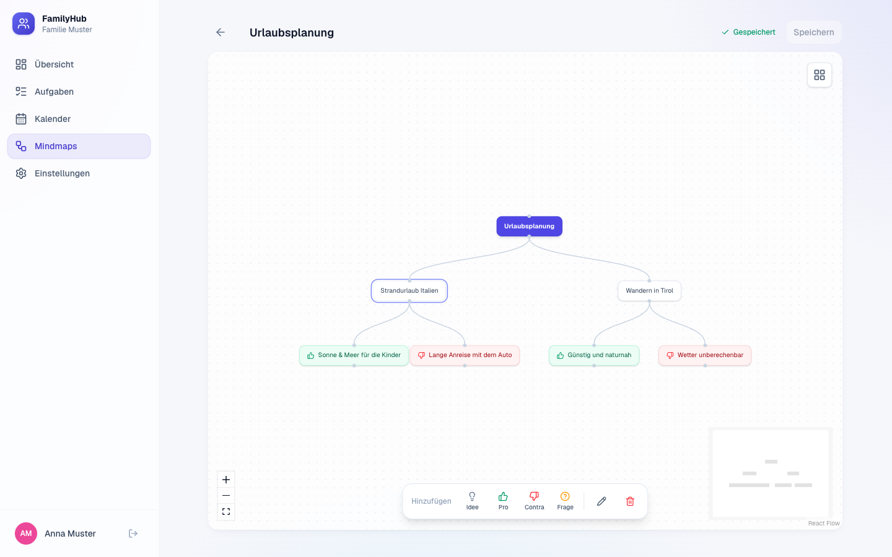

Doppeltippen öffnet den Knotendialog (Text und Art).

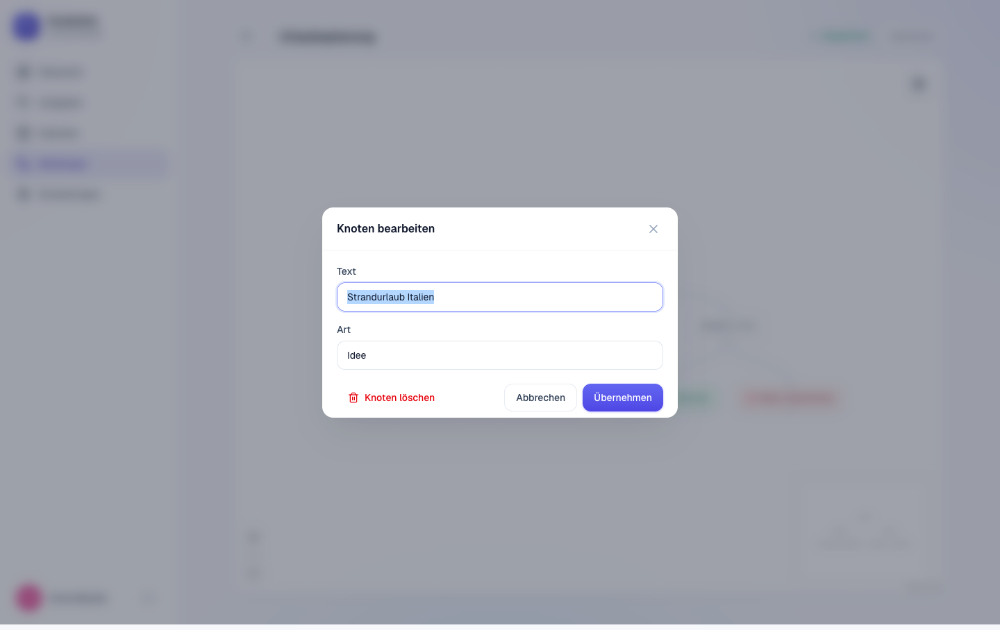

Das Raster-Symbol oben rechts startet **Auto-Layout** (vertikal oder horizontal).

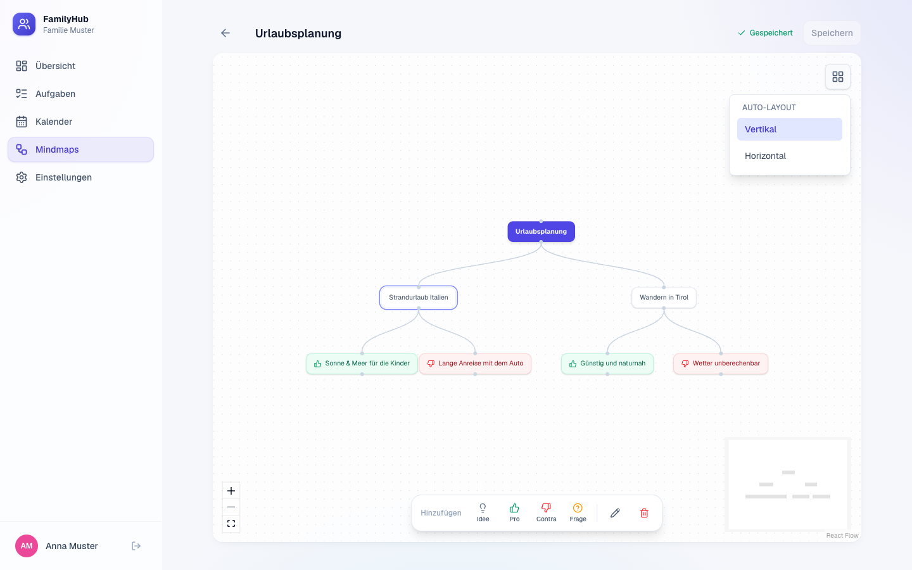

| Use-Case | Wie |
| --- | --- |
| Mindmap anlegen | **Neue Mindmap** → Titel, optional Beschreibung |
| Mindmap umbenennen | Titelzeile im Editor oder Aktionen auf der Karte |
| Mindmap löschen | Aktionen auf der Karte (mit Nachfrage) |
| Idee / Pro / Contra / Frage | Knoten wählen → Typ in der Leiste |
| Text ändern | Doppeltippen oder Stift in der Leiste |
| Knoten verschieben | Ziehen auf der Fläche |
| Automatisch anordnen | Auto-Layout vertikal oder horizontal |
| Speichern | Läuft automatisch; **Speichern** erzwingt einen Stand |

Zwei Personen gleichzeitig an derselben Map können sich überschreiben. Am besten nacheinander arbeiten.

---

## 6. Profil, Sprache und Familie

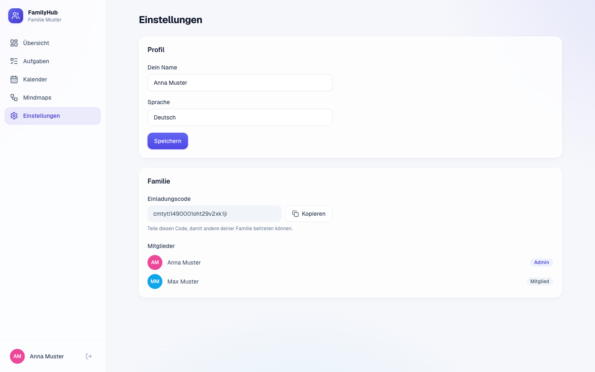

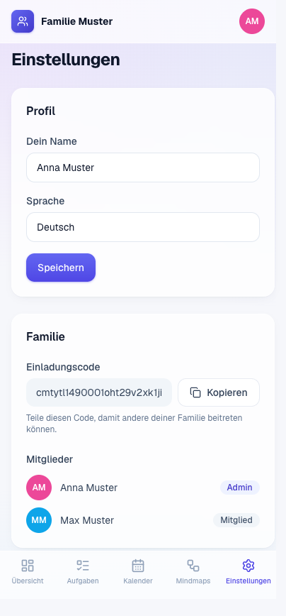

| Use-Case | Wo | Hinweis |
| --- | --- | --- |
| Namen ändern | Profil → **Speichern** | Wird bei Aufgaben und Mitgliedern angezeigt |
| Sprache wechseln | Deutsch oder Englisch | Gilt nur für dich |
| Einladungscode kopieren | Familie → **Kopieren** | Wie ein Haustürschlüssel behandeln |
| Mitglieder sehen | Admin hat die Familie gegründet, alle anderen sind Mitglied | Rollen ändern in der App nichts |
| Abmelden | Logout in der Seitenleiste | Auf dem Handy über ein geteiltes Gerät relevant |

E-Mail und Passwort lassen sich in der App nicht selbst ändern. Mitglieder entfernen geht aktuell nur über die Person, die den Server betreibt.

---

## 7. Englisch als Sprache

Jedes Mitglied wählt die Sprache selbst. Dieselbe Übersicht auf Englisch:

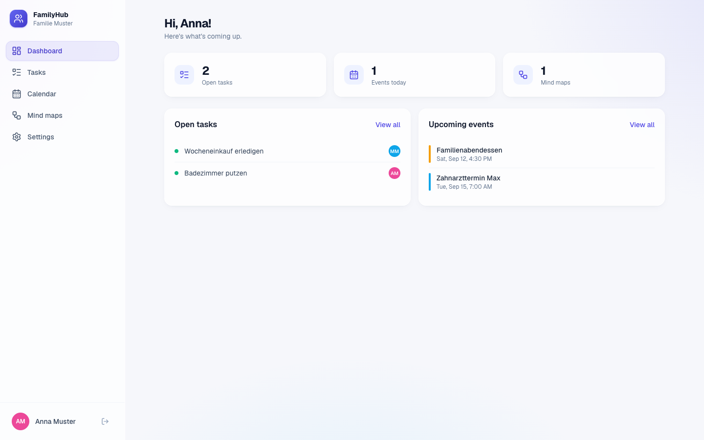

---

## 8. FamilyHub auf dem Handy

Die App ist mobil zuerst gebaut: Tab-Leiste unten mit **Übersicht**, **Aufgaben**, **Kalender**, **Mindmaps**, **Einstellungen**. Du kannst sie auf den Home-Bildschirm legen (Safari: Teilen → Zum Home-Bildschirm; Chrome: App installieren).

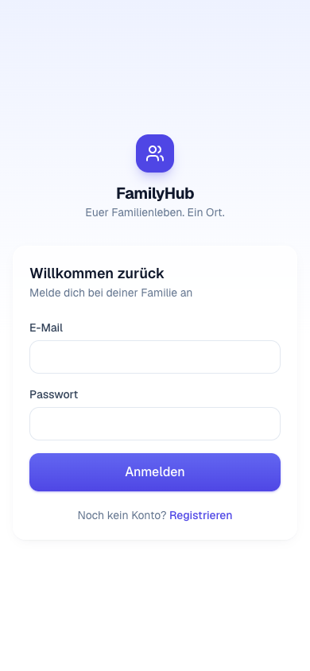

---

## Was FamilyHub bewusst nicht kann

Diese Lücken sind bekannt – keine Use-Cases, sondern Grenzen:

- Kein Passwort-Reset in der App
- Kein Konto in mehreren Familien
- Keine privaten Listen oder Termine
- Keine wiederkehrenden Termine
- Keine Push-Erinnerungen
- Kein Offline-Modus
- Kein Live-Editing derselben Mindmap
- Mitglieder nicht in der App entfernen

Mehr dazu in der [FAQ](faq.md). Vertiefung zu den einzelnen Bereichen: [Erste Schritte](erste-schritte.md), [Aufgaben](aufgaben.md), [Kalender](kalender.md), [Mindmaps](mindmaps.md), [Einstellungen](einstellungen.md).
